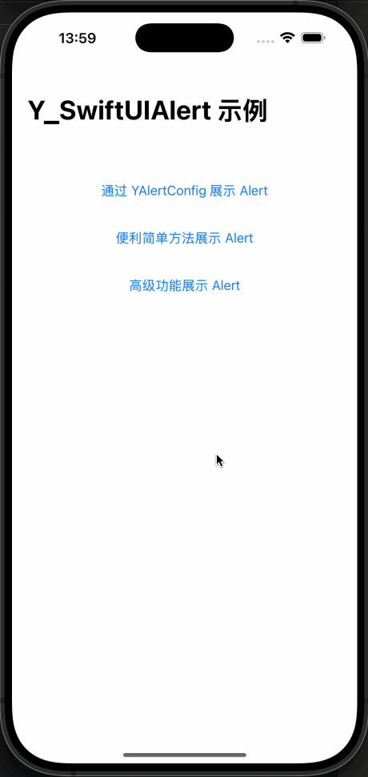

# Y_SwiftUIAlert 
基于 UIAlertController 在 SwiftUI 中使用的 Alert，调用简单，支持多种方式


## 功能说明
### 通过 Y_AlertConfig 展示 Alert
使用 Y_AlertConfig 的静态工厂方法直接创建Alert

- **简单 Alert**: `Y_AlertConfig.simple()` - 基础消息提示
- **确认 Alert**: `Y_AlertConfig.confirm()` - 确认/取消双按钮
- **危险操作**: `Y_AlertConfig.destructive()` - 红色警告按钮
- **TextField 输入**: `Y_AlertConfig.textField()` - 单输入框
- **多 TextField**: `Y_AlertConfig.multiTextField()` - 多输入框表单

**适用场景**：需要精确控制Alert配置的复杂场景，可随时改变弹窗样式、内容

```swift
struct DemoPage: View {
    @State private var alertConfig: Y_AlertConfig?

    // MARK: - Body
    var body: some View {
        NavigationView {
            xxx
        }
        // 写一个 .y_alert(config) 即可
        .y_alert($alertConfig)
    }

    // 要展示弹窗时，创建 alertConfig 即可
    func showAlertWithConfig() {
        do {
            alertConfig = try Y_AlertConfig.confirm(
                title: "弹窗标题 alert title",
                message: "弹窗消息 alert message",
                onConfirm: {
                    print("点击确认")
                },
                onCancel: {
                    print("点击取消")
                }
            )
        } catch {
            print("创建确认Alert失败: \(error)")
        }
    }
}
```

### 通过便利简单方法展示 Alert

演示 SwiftUI 风格的便利方法：

- **`.y_simpleAlert()`** - 简单消息提示
- **`.y_confirmAlert()`** - 确认对话框
- **`.y_destructiveAlert()`** - 危险操作确认
- **`.y_textFieldAlert()`** - 单输入框Alert
- **`.y_multiTextFieldAlert()`** - 多输入框Alert
- **`.y_actionSheet()`** - 操作表单样式

**适用场景**：快速实现常见Alert需求的日常开发，单个页面的弹窗样式固定

```swift
struct DemoPage: View {
    @State private var showAlert = false

    // MARK: - Body
    var body: some View {
        NavigationView {
            xxx
        }
        // 使用 showAlert bool 值,控制弹窗展示
        .y_confirmAlert("弹窗标题 alert title", isPresented: $showAlert, message: "弹窗消息 alert message") {
            print("点击确认")
        } onCancel: {
            print("点击取消")
        }
    }

    // 要展示弹窗时，showAlert = true 即可
    func showAlert() {
        showAlert = true
    }
}
```

### Y_SwiftUIAlert 的一些其他功能

- **TextField 输入验证规则** - 邮箱、手机号、密码等复杂验证
- **Builder 模式** - 链式API构建复杂Alert
- **异步 Alert** - async/await模式的Alert展示
- **性能测试** - 批量创建Alert配置的性能测试
- **自定义验证** - 用户自定义验证逻辑

**适用场景**：需要复杂验证逻辑和高度定制的场景


## Y_SwiftUIAlert Example 示例

### 1. 直接使用 Y_AlertConfig（AlertWithConfigDemo 演示）

```swift
// 简单Alert
alertConfig = try Y_AlertConfig.simple(
    title: "提示",
    message: "操作成功"
) {
    // 确认回调
}

// 确认Alert
alertConfig = try Y_AlertConfig.confirm(
    title: "确认删除",
    message: "此操作不可撤销",
    onConfirm: { /* 确认操作 */ },
    onCancel: { /* 取消操作 */ }
)

// TextField Alert
let textConfig = Y_TextFieldConfig.email()
alertConfig = try Y_AlertConfig.textField(
    title: "设置邮箱",
    textFieldConfig: textConfig,
    onConfirm: { email in /* 处理邮箱 */ }
)
```

### 2. SwiftUI 便利方法（SimpleAlertDemo 演示）

```swift
.y_simpleAlert("提示", isPresented: $showAlert, message: "操作成功")

.y_confirmAlert("确认删除", isPresented: $showConfirm) {
    // 确认回调
} onCancel: {
    // 取消回调
}

.y_textFieldAlert("输入名称", isPresented: $showInput, 
                textFieldConfig: Y_TextFieldConfig.text()) { name in
    // 处理输入
}
```

### 3. Builder 模式（AdvancedFeaturesDemo 演示）

```swift
let alert = try Y_AlertBuilder(title: "用户注册")
    .message("请填写注册信息")
    .textField(Y_TextFieldConfig.username())
    .textField(Y_TextFieldConfig.email())
    .textField(Y_TextFieldConfig.password())
    .confirmButton(title: "注册") { values in
        // 处理注册信息
    }
    .cancelButton()
    .build()
```

## 详细使用参见 Example

